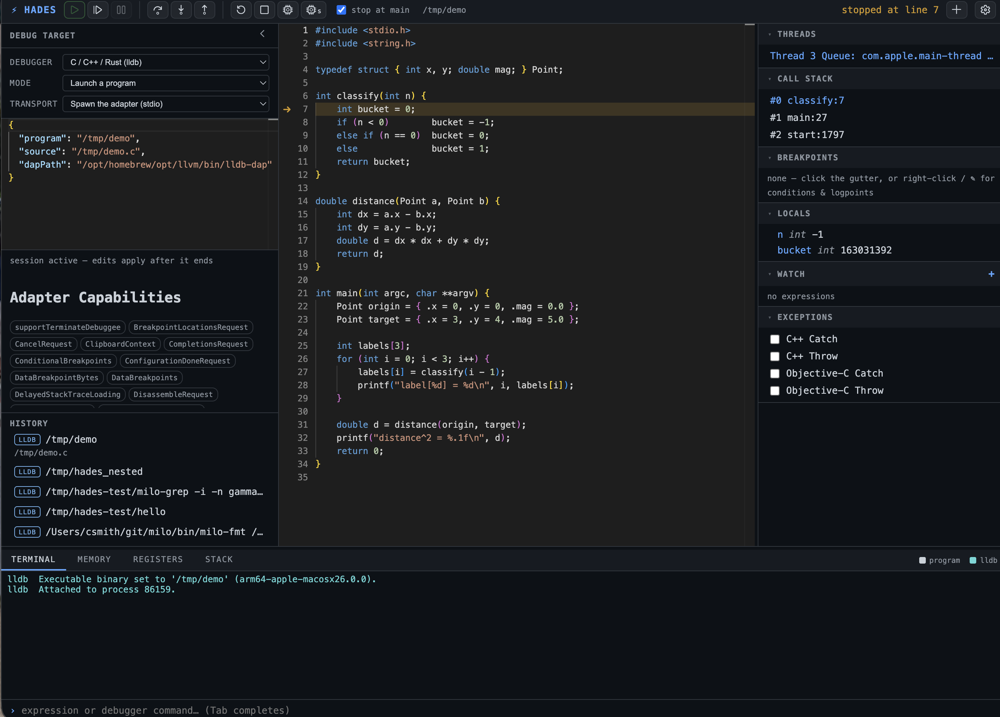

# dapweb

<p align="center">
  
</p>

Web + AI interface for any DAP debugger. Written in [Milo](https://github.com/milo-language/milo).

**[Documentation](https://milo-language.github.io/milo/)** ·
**[Download a release](https://github.com/milo-language/dapweb/releases/tag/latest)**

## Install

```sh
P=$(uname -s | tr A-Z a-z)-$(uname -m | sed 's/x86_64/x64/;s/aarch64/arm64/')
curl -fsSL https://github.com/milo-language/dapweb/releases/download/latest/dapweb-$P.tar.gz | tar xz
cd dapweb-$P
./dapweb /path/to/your-binary
```

Download through a browser instead and macOS quarantines the archive: the unsigned
binary is killed on first run and moved to the Trash. Either install with `curl` as
above, or clear the flag with `xattr -dr com.apple.quarantine <dir>` before running.

`--version` prints the commit the binary was built from. Releases roll on the `latest`
tag, so re-running the install command is the update path.

One binary, two subcommands:

- **`dapweb web`** — React + Monaco + xterm.js served by a Milo HTTP/WebSocket server that drives a DAP adapter (lldb-dap, debugpy, delve). Breakpoints (Monaco glyph gutter), stepping, threads, call stack, expandable locals, watch expressions, a debug console (full lldb command access), and a real PTY terminal — type into your program *while it runs*. Fully self-hosted: no CDN assets. Boots idle: open the UI and set the target in the ⚙ drawer — a VS Code launch-configuration JSON with per-debugger schema autocomplete (templates seed a starter config; the last 10 targets are one click away).
- **`dapweb api`** — drive that same session from the CLI. Every verb is the exact `{"cmd": ...}` JSON the browser sends, so an agent, a shell script, or plain `curl` can list sessions, set breakpoints, run, step, and evaluate — no browser, no MCP. `dapweb api request` forwards arbitrary DAP-shaped JSON, so any adapter capability works with no new subcommand.
- **Shared session** — `dapweb web` hosts ONE session; every browser tab and every `dapweb api` call see and drive the same debuggee. Stop in the browser, have an agent evaluate an expression over `dapweb api`, watch the result appear in the UI.

## Build

```sh
src/web/ui/build.sh                                  # bundle UI → src/web/ui/dist (bun)
bun run ../milo/src/main.ts build src/main.milo -o dapweb
```

`build.sh` must run before `milo build`: the UI bundle is compiled into the binary with `embedFile()`, so a release is a single self-contained file that runs from any directory. For UI work, `--webroot src/web/ui/dist` serves from disk instead — `build.sh` + a browser refresh, no server rebuild.

## Run

```sh
# The 90% invocation: a path implies `web`, trailing tokens are the debuggee's argv.
clang -g -O0 examples/interactive.c -o /tmp/demo
./dapweb /tmp/demo alpha --beta

# Boots idle — open http://localhost:8080 and configure the target in the ⚙ drawer.
./dapweb web --port 8080

# Name the target with flags. --source is optional: the first stop's DWARF
# frame path auto-loads the editor. Type is inferred (.py → debugpy, .go → delve).
./dapweb web --program /tmp/demo --port 8080
./dapweb web --program demo.py

# --launch takes a VS Code launch configuration (inline JSON or a file path;
# any launch.json keys pass through to the adapter — args/env/cwd/initCommands/…)
./dapweb web --launch '{"type":"lldb","program":"/tmp/demo","args":["alpha"],"env":{"K":"V"}}'
./dapweb web --launch '{"type":"lldb","request":"attach","pid":12345}'
# …or a whole .vscode/launch.json; pick an entry by name
./dapweb web --launch .vscode/launch.json --config "debug tests"

# Drive a running session from the CLI (an agent, a script, or you).
./dapweb api list                          # live sessions (auto-prunes dead ones)
./dapweb api break --line 12               # set a breakpoint
./dapweb api run                           # launch; blocks until the first stop
./dapweb api eval 'x + 1'                  # evaluate in the current stop frame
./dapweb api state                         # JSON snapshot (phase, stop, stack, bps)

# Raw passthrough: any DAP-shaped command, block for a reply type of your choosing.
./dapweb api request --await stopped '{"cmd":"continue"}'
```

With one live session, `api` finds it automatically; with several, pass `--session <id>`
or `--port <n>`. Run `dapweb <command> --help` (or `dapweb api`) for the full command list.

> The API and WebSocket bind to whatever `dapweb web` listens on and are unauthenticated —
> `eval` reaches the debugger, so treat an exposed port as remote code execution. Keep it on
> localhost unless you intend otherwise.

## Tests

```sh
bun tests/e2e.ts        # full web-session flow against a live server (start one on 8091 first)
bun tests/e2e-config.ts # launch-config redesign: inline run config, force-kill, history (self-spawns)
bun tests/api.ts        # HTTP API flow: list/state/run/step/eval (self-spawns a server)
```

Architecture and roadmap: `docs/design.md`.
