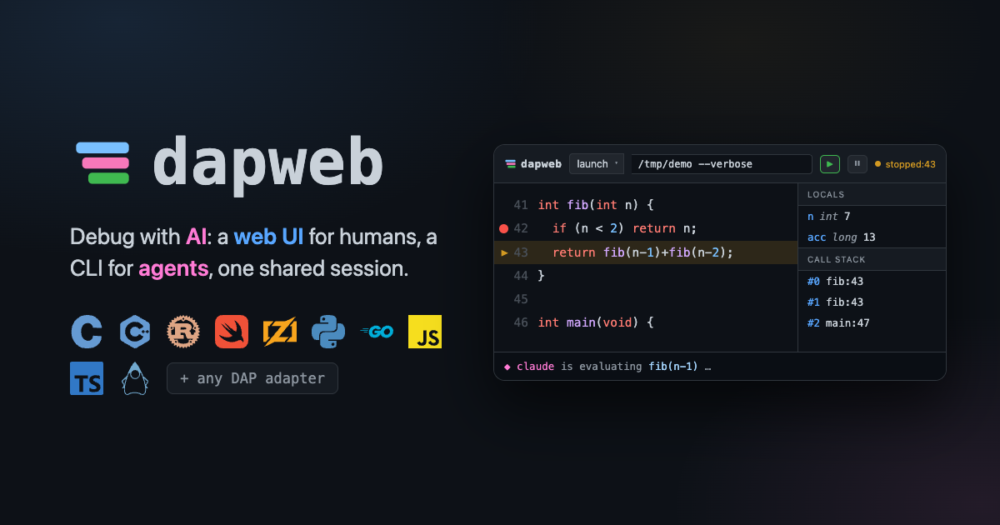
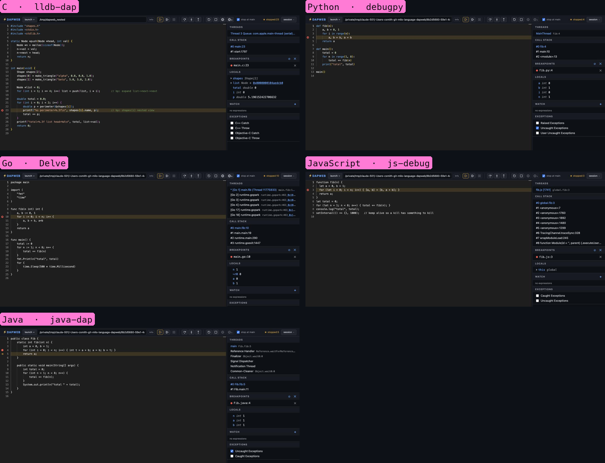
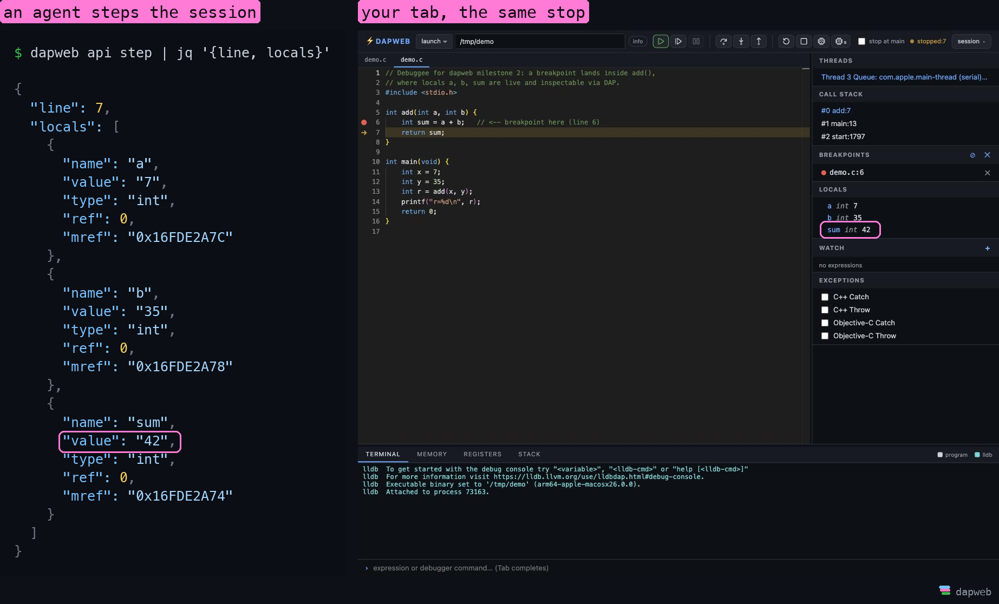
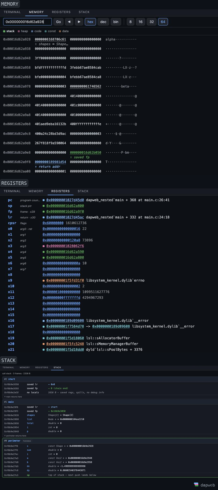
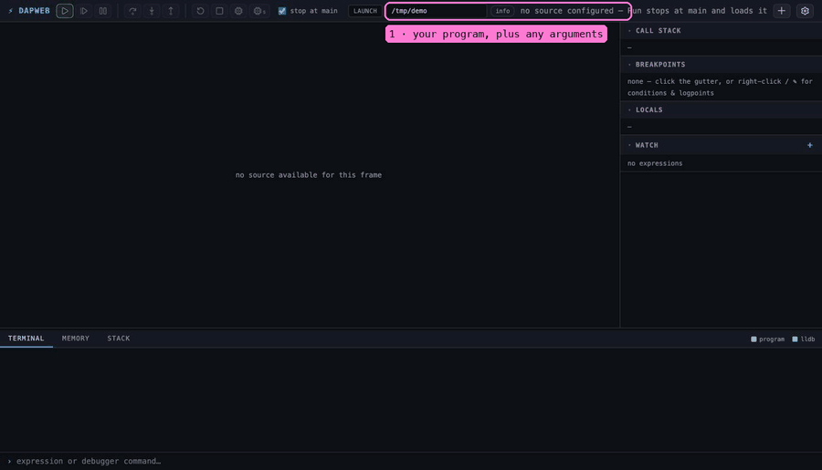

<p align="center">
  
</p>

<p align="center">
  <b><a href="https://github.com/milo-language/dapweb/releases/tag/latest">Download</a></b> ·
  <b><a href="https://milo-language.github.io/milo/">Docs</a></b> ·
  built in <a href="https://github.com/milo-language/milo">Milo</a>
</p>

A browser front end for any DAP debugger, built so that you and an AI agent can
drive the same debuggee at the same time.

<p align="center">
  
</p>

## The debuggers

dapweb drives a debugger through its Debug Adapter Protocol front end, which by
now is nearly all of them. Five are known by name; the rest are the same thing
with the path spelled out:

| adapter | languages | how dapweb finds it |
| --- | --- | --- |
| **lldb-dap** | C, C++, Objective-C, Rust, Swift, Zig | `lldb-dap` on `PATH`, else `xcrun -f lldb-dap` |
| **debugpy** | Python | `python3 -m debugpy.adapter` |
| **Delve** | Go | `dlv dap` |
| **js-debug** | JavaScript, TypeScript | `js-debug-adapter` on `PATH`, else `~/.local/share/dapweb/js-debug` |
| **java-dap** | Java, and anything else on JDWP | `java-dap` on `PATH` |
| **any other DAP adapter** | everything else | `--dapPath "gdb -i dap"`, `--dapPath /path/to/adapter` |

CodeLLDB, `gdb -i dap` (gdb 14+), netcoredbg for C#/.NET, rdbg for Ruby, Xdebug
for PHP, earlybird for OCaml, probe-rs and cortex-debug for embedded targets:

```sh
./dapweb web --dapPath /path/to/some-dap-adapter --program ./a.out
```



## An agent is a first-class user

The session can be driven from the CLI while you watch it in the browser:

```console
$ dapweb api step --pretty
{
  "type": "stopped",
  "line": 24,
  "path": "/src/examples/nested/main.c",
  "frames": [
    { "id": 1572864, "name": "main", "line": 24, "path": "/src/examples/nested/main.c", "ipRef": "0x1026285AC" },
    { "id": 1572865, "name": "start", "line": 1797, "path": "/usr/lib/dyld`start", "ipRef": "0x189981D54" }
  ],
  "locals": [
    { "name": "shapes", "value": "Shape[2]", "type": "Shape[2]", "ref": 4, "mref": "0x16D7D6918" },
    { "name": "list", "value": "0x0000000102c0dcb0", "type": "Node *", "ref": 5, "mref": "0x16D7D6858" },
    { "name": "p", "value": "5.196152422706632", "type": "double", "ref": 0, "mref": "0x16D7D6838" }
  ]
}
```

The open tab moves to line 24 as that runs, and says who moved it:




## Features

- Breakpoints
- Conditional breakpoints
- Hit counts
- Log points
- Persistent breakpoints
- Step over/in/out
- Instruction stepping
- Restart
- Attach by name
- Stop at main
- Call stack
- Threads
- Nested locals
- Editable values
- Watch expressions
- Exception filters
- Expression eval
- Tab completion
- Disassembly
- Register table
- Hex / dec / oct / bin
- Memory viewer
- Region colors
- Memory annotations
- Pointer following
- Stack slots
- Program terminal
- Syntax highlighting
- VS Code launch configs
- Form ⇄ JSON config editor
- Target history
- Agent-started sessions
- Binary info
- CLI API
- Multi-peer sessions
- Session list

## Down at the machine



Stack, heap, code, const and data each get a colour, in the dump and on the
registers that point into them. The line under a word says what the bytes are: a
named local, a saved frame pointer, a return address, the string a pointer lands
on.

## Install

```sh
P=$(uname -s | tr A-Z a-z)-$(uname -m | sed 's/x86_64/x64/;s/aarch64/arm64/')
curl -fsSL https://github.com/milo-language/dapweb/releases/download/latest/dapweb-$P.tar.gz | tar xz
cd dapweb-$P && ./dapweb /path/to/your-binary
```

Use `curl`, not a browser download: macOS quarantines the archive and kills the
unsigned binary on first run. Re-run the command to update.

## Using it

Point it at a program, click a line to break on it, press Run. That is the whole
loop:



Click **LAUNCH** to flip the bar to **ATTACH** and pick a running process by name
instead of hunting for its pid:


## CLI

```sh
./dapweb /tmp/demo alpha --beta   # a path implies `web`; trailing tokens are argv
./dapweb web --port 8080          # boot idle, set the target in the browser
./dapweb web --launch .vscode/launch.json --config "debug tests"
```

`dapweb web` holds the session in the foreground, which is the wrong shape when
something else is starting it. `dapweb start` spawns one in the background,
waits for it to come up, and prints its identity — so an agent can start a
session and hand you the url to watch it in:

```sh
$ ./dapweb start --program /tmp/demo --source main.c
{"ok":true,"sessionId":"jolly-ledger-guides","port":8080,"url":"http://localhost:8080",...}
$ ./dapweb api --session jolly-ledger-guides run
```

Every flag other than `--port` is forwarded to `web` unchanged. `--port` defaults
to the first free port from 8080.

`dapweb api` drives a running session with the same `{"cmd":...}` JSON the
browser sends, so an agent or a shell script needs no separate protocol:

```sh
./dapweb api list                 # live sessions
./dapweb api break --line 12
./dapweb api run                  # blocks until the first stop
./dapweb api step --pretty        # step, and indent the reply for a human
./dapweb api eval 'x + 1'
./dapweb api request --await stopped '{"cmd":"continue"}'
```

With one live session `api` finds it; otherwise pass `--session <id>` or
`--port <n>`. `dapweb <command> --help` lists the rest.

`dapweb api spec` prints the whole `{"cmd":...}` vocabulary — what each command
takes, which reply `--await` should block for, and which DAP request it becomes.
The same table is served at `/api/commands`. Where a command forwards to the
adapter, its arguments and reply are that DAP request's, specified at
<https://microsoft.github.io/debug-adapter-protocol/specification>; the rest are
dapweb's own. An unrecognised command is refused and names the vocabulary back
at you, and `api request` exits non-zero so a script can branch on it.

> Unauthenticated, and `eval` reaches the debugger — an exposed port is remote
> code execution. Keep it on localhost.

## Develop

```sh
scripts/build.sh        # UI bundle, then the binary that embeds it
scripts/test.sh         # every suite against that build, each on its own server
scripts/test.sh agent   # one suite (substring match)
```

The README images are generated, not hand-cropped: `docs/shots/` holds the raw
screenshots, `docs/*.json` the crops and callouts drawn over them, and
`scripts/annotate-shots.py` does the drawing (it reads the palette out of
`styles.css`, so the pictures cannot drift from the UI). The card at the top is
`src/web/ui/og-card.html`, screenshotted headless; the command is in its
comment. `docs/design-system.md` is the rest of the rules.

```sh
python3 -m venv /tmp/venv && /tmp/venv/bin/pip install Pillow
for spec in docs/*.json; do /tmp/venv/bin/python scripts/annotate-shots.py "$spec"; done
```
