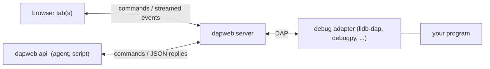
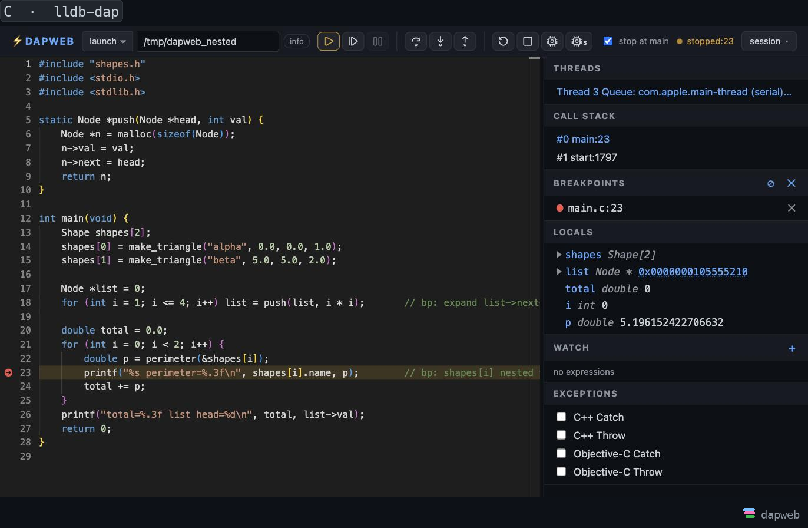
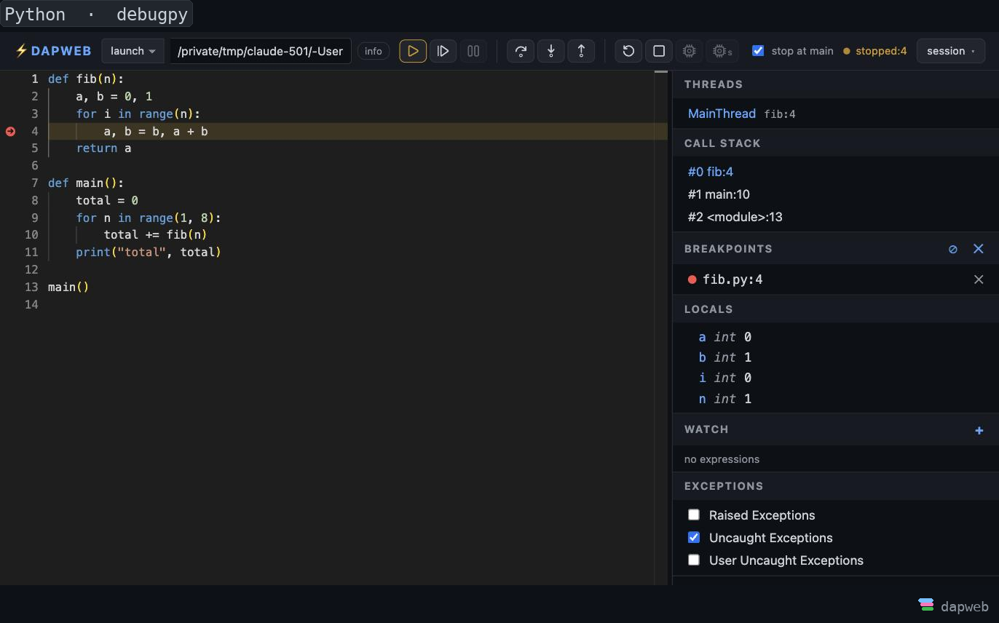
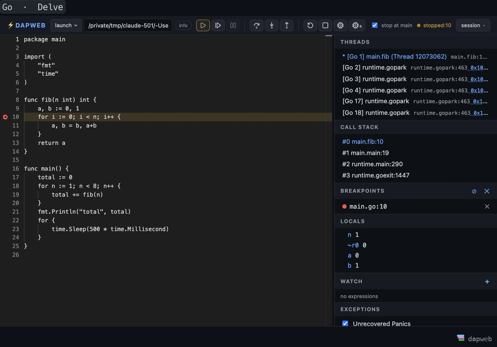
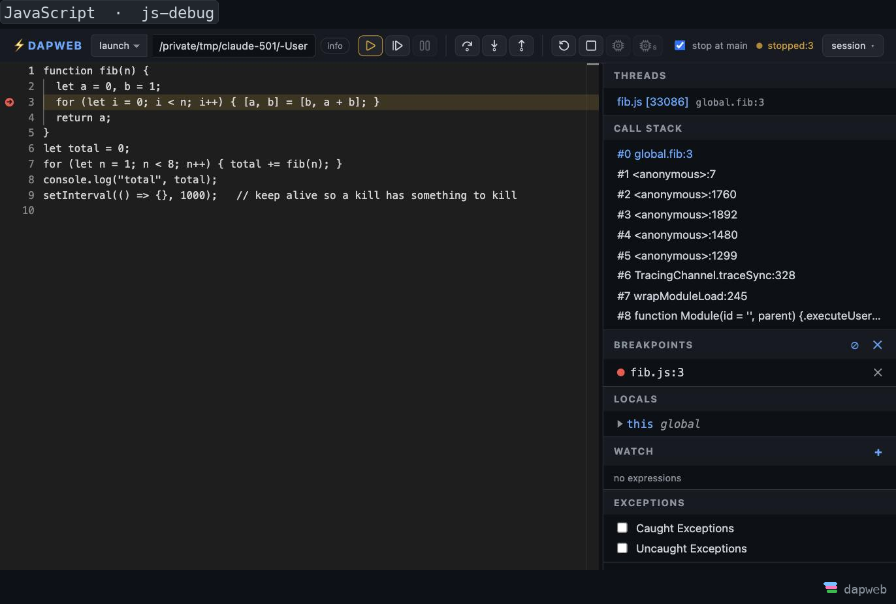
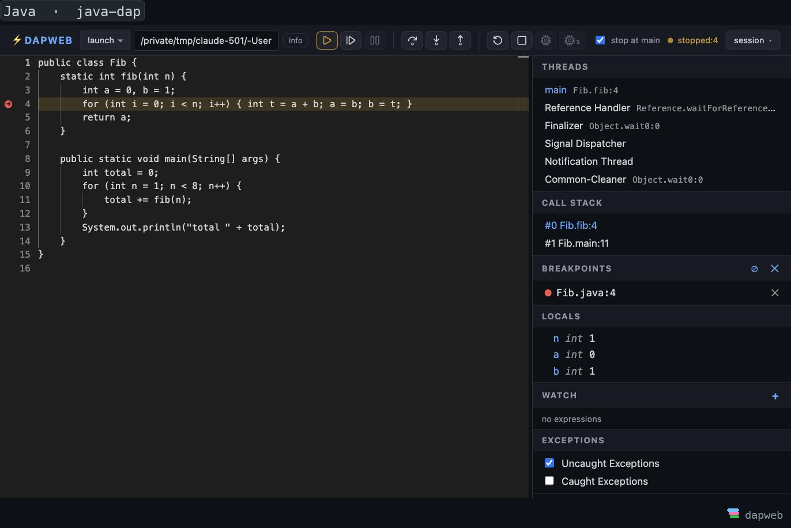

<p align="center">
  
</p>

<p align="center">
  <b><a href="#install">Install</a></b> ·
  built in <a href="https://github.com/milo-language/milo">Milo</a>
</p>

dapweb lets you control a debugger from a web ui, as well as programmatically control a debugger from a cli. All clients interacting with the debugger view the same output.


```mermaid
flowchart LR
  browser["browser tab(s)"] <-- "commands / streamed events" --> server["dapweb server"]
  cli["dapweb api&nbsp;&nbsp;(agent, script)"] <-- "commands / JSON replies" --> server
  server <-- DAP --> adapter["debug adapter (lldb-dap, debugpy, ...)"]
  adapter --- debuggee["your program"]
```

One session, many peers: commands from any peer funnel into the same debugger,
and every event is broadcast back to all of them.

To start the web ui, run
```
dapweb web
```

To interact with debug sessions, run
```console
$ dapweb api break --line 12
{"ok":true}
$ dapweb api run
{"type":"stopped","line":12,"path":".../examples/demo.c","frames":[{"id":1572864,"name":"main","line":12,...}],"locals":[{"name":"x","value":"7","type":"int",...},...]}
$ dapweb api eval 'x + y'
{"type":"evalResult","id":0,"value":"(int) $0 = 42","ref":0}
$ dapweb api list
ID                      PORT   PID     PROGRAM
solar-maple-moves       8081   54983   /tmp/demo
```

With more than one session live, add `--session <id>` (or `--port <n>`) to any
of these.

<p align="center">
  
</p>

## Language Support

dapweb supports *any* debugger for *any* language as long as it conforms to the
[Debug Adapter Protocol](https://microsoft.github.io/debug-adapter-protocol/) (DAP).
In practice, [basically all debuggers](https://microsoft.github.io/debug-adapter-protocol/implementors/adapters/)
support this now.

| adapter | languages | how dapweb finds it |
| --- | --- | --- |
| **lldb-dap** | C, C++, Objective-C, Rust, Swift, Zig | `lldb-dap` on `PATH`, else `xcrun -f lldb-dap` |
| **debugpy** | Python | `python3 -m debugpy.adapter` |
| **Delve** | Go | `dlv dap` |
| **js-debug** | JavaScript, TypeScript | `js-debug-adapter` on `PATH`, else `~/.local/share/dapweb/js-debug` |
| **java-dap** | Java, and anything else on JDWP | `java-dap` on `PATH` |
| **any other DAP adapter** | everything else | `--dapPath "gdb -i dap"`, `--dapPath /path/to/adapter` |

Adapters known to work with the `--dapPath` route include:

- CodeLLDB
- `gdb -i dap` (gdb 14+)
- netcoredbg for C#/.NET
- rdbg for Ruby
- Xdebug for PHP
- earlybird for OCaml
- probe-rs and cortex-debug for embedded targets

```sh
./dapweb web --dapPath /path/to/some-dap-adapter --program ./a.out
```

The same stop, five languages, find yours:

### C · lldb-dap



### Python · debugpy



### Go · Delve



### JavaScript · js-debug



### Java · java-dap



## An agent is a first-class user

The debugger can be interacted with from the CLI while you watch it in the browser, and vice versa:

```console
$ dapweb api step --pretty
{
  "type": "stopped",
  "line": 24,
  "path": "/src/examples/nested/main.c",
  "frames": [
    { "id": 1572864, "name": "main", "line": 24, "path": "/src/examples/nested/main.c", "ipRef": "0x1026285AC" },
    { "id": 1572865, "name": "start", "line": 1797, "path": "/usr/lib/dyld`start", "ipRef": "0x189981D54" }
  ],
  "locals": [
    { "name": "shapes", "value": "Shape[2]", "type": "Shape[2]", "ref": 4, "mref": "0x16D7D6918" },
    { "name": "list", "value": "0x0000000102c0dcb0", "type": "Node *", "ref": 5, "mref": "0x16D7D6858" },
    { "name": "p", "value": "5.196152422706632", "type": "double", "ref": 0, "mref": "0x16D7D6838" }
  ]
}
```

The open tab reflects the new state, and prints a message in the console showing that an external client made a request.


## Features

- **Multi-peer sessions**: you, your agent, and anyone else's terminal attached
  to the same live debuggee, every peer seeing every stop.
- **CLI API**: every debugger action as `dapweb api <cmd>` with a JSON reply an
  agent can parse; the command vocabulary is served at `/api/commands` and
  printed by `dapweb api spec`.
- **Agent-started sessions**: the agent launches the debuggee in the
  background, and the session appears in your open tab.
- **The full breakpoint kit**: conditional, hit counts, log points, persistent
  across restarts.
- **Expression eval with tab completion** in the program terminal.
- **Nested locals, editable values, watch expressions.**
- **Memory viewer**: color coded by region (stack, heap, code, ...), slots
  annotated with the locals and frame anatomy that live there, pointers
  followable by click.
- **Register table**: role, module, and points-at per register,
  changed-since-last-stop marks, hex/dec/oct/bin.
- **Disassembly and instruction stepping.**
- **VS Code launch configs**: reuse an existing `.vscode/launch.json`, edited
  as a form or as JSON, both views of the same text.

## System Details

Additional features include a memory inspector, register inspector, and stack visualization. Each of these is color coded to reflect which memory region the address is in (stack, heap, global, etc).


## Install

```sh
P=$(uname -s | tr A-Z a-z)-$(uname -m | sed 's/x86_64/x64/;s/aarch64/arm64/')
curl -fsSL https://github.com/milo-language/dapweb/releases/download/latest/dapweb-$P.tar.gz | tar xz
cd dapweb-$P && ./dapweb /path/to/your-binary
```

Use `curl`, not a browser download: macOS quarantines the archive and kills the
unsigned binary on first run. Re-run the command to update.

## Usage


You can choose between Launch and Attach. For launch, you can provide the executable and arguments to launch with. For attach you can choose from a list of running processes.


## CLI

```sh
./dapweb /tmp/demo alpha --beta   # a path implies `web`; trailing tokens are argv
./dapweb web --port 8080          # boot idle, set the target in the browser
./dapweb web --launch .vscode/launch.json --config "debug tests"
```

`dapweb web` holds the session in the foreground, which is the wrong shape when
something else is starting it. `dapweb start` spawns one in the background,
waits for it to come up, and prints its identity — so an agent can start a
session and hand you the url to watch it in:

```sh
$ ./dapweb start --program /tmp/demo --source main.c
{"ok":true,"sessionId":"jolly-ledger-guides","port":8080,"url":"http://localhost:8080",...}
$ ./dapweb api --session jolly-ledger-guides run
```

Every flag other than `--port` is forwarded to `web` unchanged. `--port` defaults
to the first free port from 8080.

`dapweb api` drives a running session with the same `{"cmd":...}` JSON the
browser sends, so an agent or a shell script needs no separate protocol:

```sh
./dapweb api list  # live sessions
./dapweb api break --line 12
./dapweb api run  # blocks until the first stop
./dapweb api step --pretty  # step, and indent the reply for a human
./dapweb api eval 'x + 1'
./dapweb api request --await stopped '{"cmd":"continue"}'
```

Each event is recorded to `$XDG_STATE_HOME/dapweb/journal.db`, which can be queried by the AI if desired:

```sh
./dapweb log --limit 40                 # what just happened, any session
./dapweb log --session <id> --json      # one session, JSONL, for an agent
./dapweb log --dir in --kind setBreakpoint
./dapweb log --sessions                 # what has been debugged
./dapweb log --breakpoints              # per line: sessions set vs sessions hit
```

Note: Unauthenticated, and `eval` reaches the debugger — an exposed port is remote code execution. Keep it on localhost.

## Develop

```sh
scripts/build.sh        # UI bundle, then the binary that embeds it
scripts/test.sh         # every suite against that build, each on its own server
scripts/test.sh agent   # one suite (substring match)
```

The README images are generated, not hand-cropped: `docs/shots/` holds the raw
screenshots, `docs/*.json` the crops and callouts drawn over them, and
`scripts/annotate-shots.py` does the drawing (it reads the palette out of
`styles.css`, so the pictures cannot drift from the UI). The card at the top is
`src/web/ui/og-card.html`, screenshotted headless; the command is in its
comment. `docs/design-system.md` is the rest of the rules.

```sh
python3 -m venv /tmp/venv && /tmp/venv/bin/pip install Pillow
for spec in docs/*.json; do /tmp/venv/bin/python scripts/annotate-shots.py "$spec"; done
```
